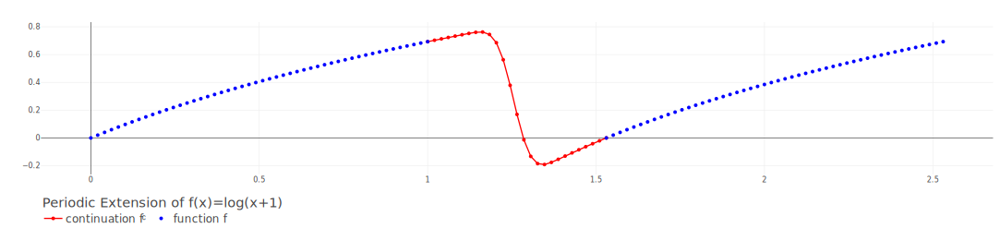
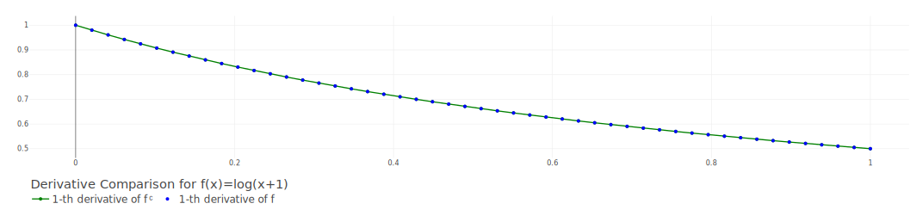

## FourierContinuation.jl

A periodic extension framework for high-order PDE solvers

This tool provides an interface for Fourier Continuation (FC) of non-periodic functions [[1]](#ref1).
The FC extends a smooth real-valued function `f` defined on the unit interval `[0,1]` into a periodic function 
`fᶜ` defined on a larger interval `[0,b]`. Moreover, since `fᶜ` is generated by a band-limited trigometric polynomial, 
the (higher-order) derivatives of `f` can be retrieved by spectral differentiation. 

Let `G` be a uniform grid on `[0,1]`, and let `Gᶜ` be its extension on `[0,b]`.
The FC generates a discrete extension operator `P: f(G) ↦ fᶜ(Gᶜ)` and a
discrete derivative operator `Dᵏ:f(G) ↦ (fᶜ)ᵏ(G)`. The next two figures show the
continuation of `f(x)=log(x+1):[0,1]→R` and its first order derivative.





## Installation

This package is unregistered and requires a Julia version >=1.11. It can added by 

```julia
julia> ] add https://github.com/vanmcmx/FourierContinuation.jl
```

## Usage

```julia
julia> using FourierContinuation
```

In the following the FC(Gram) accelerated method [[2]](#ref2) is used to generate a
discrete FC operator `Op` and its corresponding discrete derivative operator `D`.

### Periodic Extension

Create an object with the default parameters using `BigInt` and `BigFloat`
to compute the FC operator in high-precision arithmetic.

```julia
params = FCGramParameters{BigInt,BigFloat}() 
```

Generate the discrete extension operator. This example use thewith
Dirichlet boundary conditions on both ending points of the unit interval.

```julia
Op = FCGram(params)
```

Provide a real valued function `f` that is well defined on the unit interval `[0,1]`, 
e.g. `f(x)=ln(x+1)`.

```julia
f(x) = log(x + one(x))
```

Plot the function and its periodic continuation.

```julia
fcplot(Op, f)
```

### Derivative approximation

Generate the derivative operator using the FC operator. The computations are carried out using 
double-precision arithmetric.

```julia
D = FCDerivative(Float64, Op, 1)
```

Provide the derivative of the previous function.

```julia
df(x) = inv(x + one(x))
```

Compare the derivative values of the function and its continuation.

```julia
info_fc(D, f, df)
```

Plot the derivatives of both the function and its periodic continuation.

```julia
fcplot(D, f, df)
```

## Cite

<a name="ref2"></a>[1] [O. P. Bruno et al. (2007) Accurate, high-order representation of complex three-dimensional surfaces via Fourier continuation analysis](https://doi.org/10.1016/j.jcp.2007.08.029)

<a name="ref1"></a>[2] [Amlani & Bruno (2016) An FC-based spectral solver for elastodynamic problems in general three-dimensional domains](https://doi.org/10.1016/j.jcp.2015.11.060)


## Similar packages or implementations

- [Fourier-continuation](https://github.com/gschivre/Fourier-continuation)
- [Global-Fourier-Continuation](https://github.com/Kumar20-21/Global-Fourier-Continuation)
- [Fourier Continuation Gram Matrices](https://github.com/neuraloperator/FCGram)
